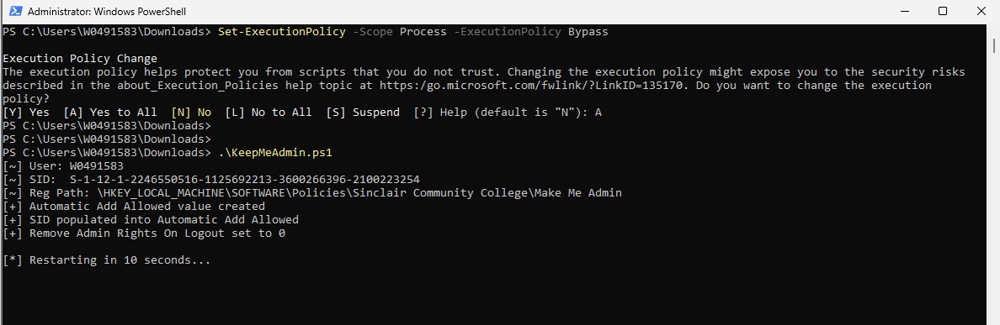
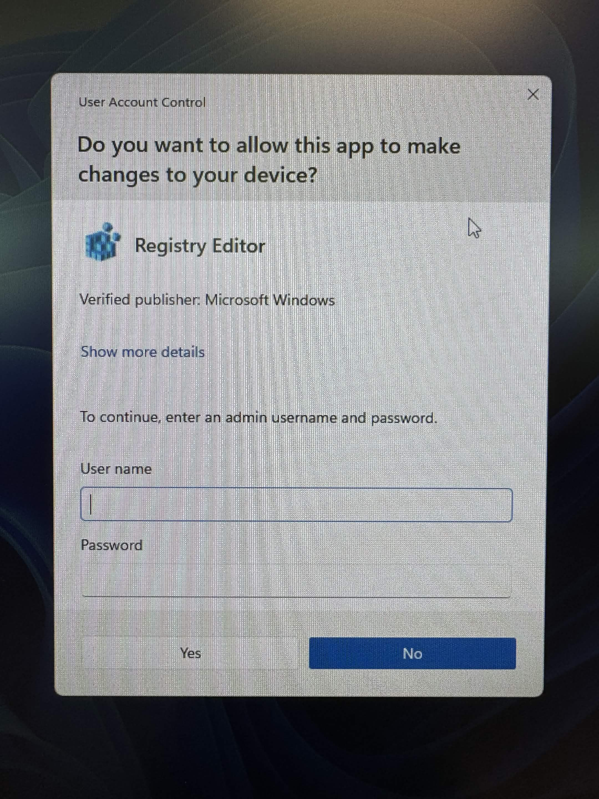
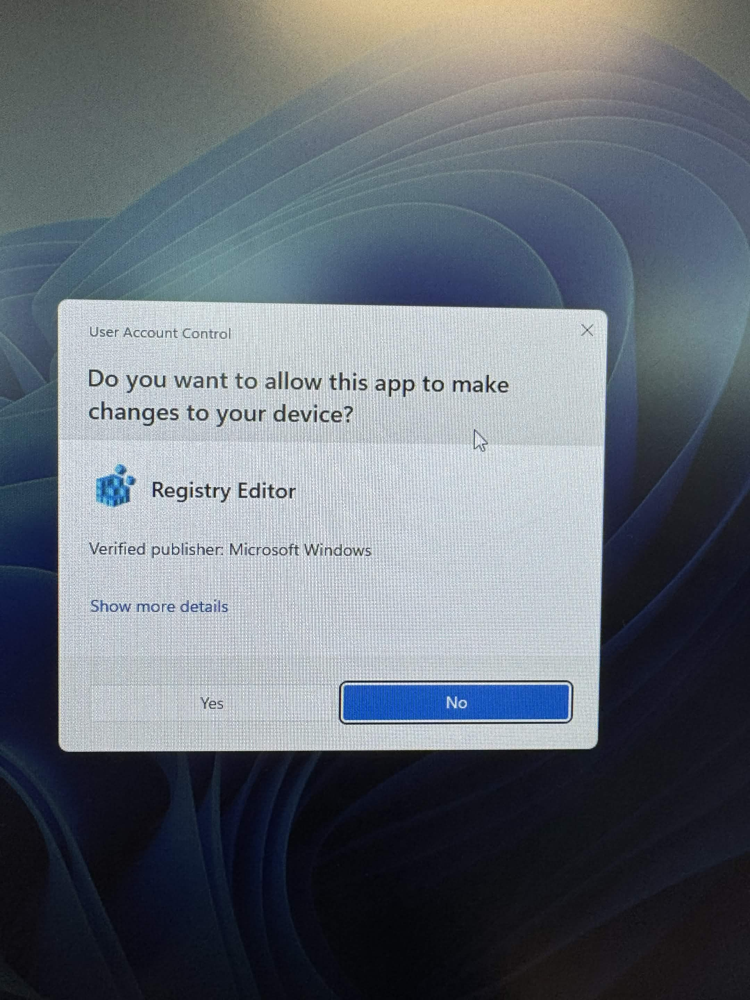

# KeepMeAdmin

Automates the MakeMeAdmin configuration so your session is permanently elevated without needing to enter your domain password every time you run something as administrator.

The script grabs your current user's SID, creates the `Automatic Add Allowed` registry entry under the MakeMeAdmin policy key, populates it with your SID, and sets `Remove Admin Rights On Logout` to disabled. The machine restarts to apply the changes.

## Steps

1. Install and run the Make Me Admin program
2. Open PowerShell as Administrator and complete the credential prompt once
3. Set execution policy for the session:

```powershell
   Set-ExecutionPolicy -Scope Process -ExecutionPolicy Bypass
```

4. Run the script:

```powershell
   .\KeepMeAdmin.ps1
```



The machine will restart automatically. After logging back in, your session will be permanently elevated. No password prompt required until the domain policy cycles.


**Before:**


**After:**

